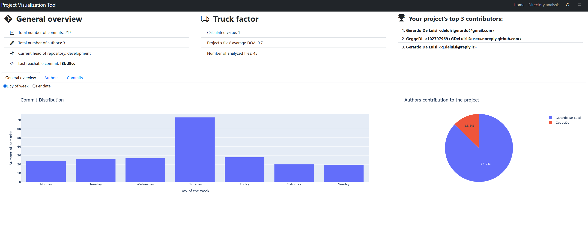
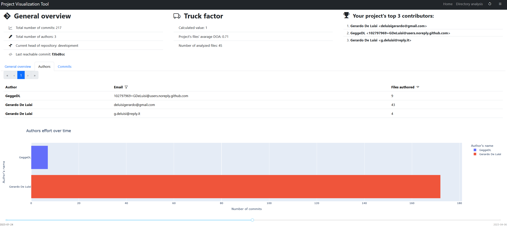

# Project visualization tool
Project visualization tool is a tool that provides you with many kind of metric visualizations of your git repository.

With Project visualization tool you can:

- See who worked on different parts of the project
- Get an overview of the file structure
- See how your project has looked at different points in time
- Find all SATD placed inside the project's code
- Who worked on different subsystems in the past?


## Get started:

- In your terminal, navigate to a git repository or a folder containing any repository
- Run the command "project-viewer" specifying the path your git repository folder
- The application will now open in your default browser.

## Note

To use Project visualization tool, you will need to have the following programs installed:
- Python interpreter version >= 3.10
- git 2.29 or newer

To check for git and python versions open a terminal and execute these commands:
```
python --version
git --version
```

## What makes Project visualization tool different?
- Private by design
- Works offline
- Git provider agnostic - works with any git repository
- No tracking, no ads, no cloud, no servers, no subscription